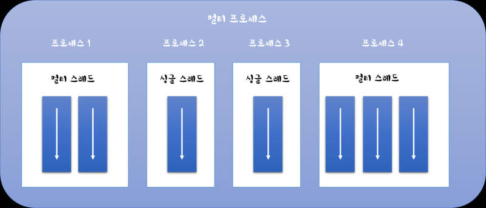
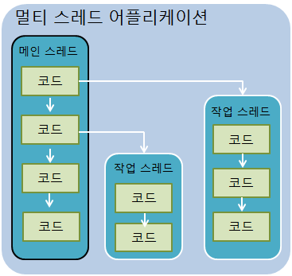
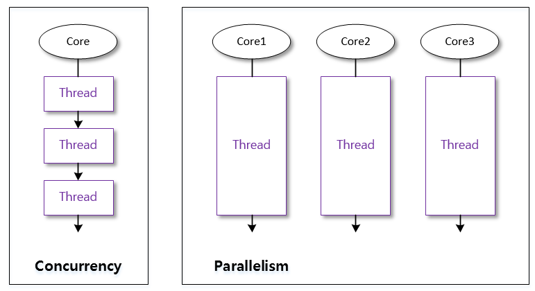

# 멀티 스레드의 개념

## 프로세스와 스레드
```
운영체제 에서는 실행 중인 하나의 어플리케이션을 프로세스라고 부른다.
하나의 애플리케이션은 다중 프로세스를 만들수 있으며 이것을 멀티태스킹이라고 한다.

[멀티태스킹] 은 두 가지 이상의 작업을 동시에 처리하는것
EX)미디어 플레이어 (동영상+음악 재생)
!꼭 멀티 프로세스를 뜻하지는 않는다.

이 처럼 하나의 프로세스가 두 가지 이상의 작업을 처리할 수 있는것은 [멀티 스레드] 때문이다.
```

## 스레드
```
스레드는 한 가닥 실이라는 뜻으로서 한 가지 작업을 실행하기 위해 순차적으로 코드를 실처럼 이어 놓았다고 해서 스레드

하나의 스레드는 하나의 코드 실행 흐름이기 때문에 한 프로세스 내에 스레드가 2개라면 두 개의 코드 실행 흐름이 생긴다는 의미
```


## 멀티스레드
```
멀티 프로세스들은 운영체제에서 할당받은 자신의 메모리를 가지고 실행하기 때문에 서로 독립적 이기 때문에
하나의 프로세스에서 오류가 발생해도 다른 프로세스에게 영향을 미치지 않음
```
```
멀티 스레드는 하나의 프로세스 내부에서 생성되기 때문에 오류 발생시 다른 스레드에 영향을 준다.
!멀티 스레드는 예외 처리에 신경을 특히 써야한다.
```
```
싱글 스레드 일시 메인 스레드가 종료되면 프로세스도 종료되나,
멀티 스레드는 실행중인 스레드가 하나라도 있다면 종료되지 않는다.
```


### 스레드 이름 
```
thread.setName("쓰레드이름");
thread.getName("쓰레드이름");
```
위의 메소드는 Thread의 인스턴스 메소드이므로 스래드 객체의 참조가 필요!
참조가 없다면 정적메소드인 currentThread()로 현재 스레드의 참조를 얻을 수 있음
```
Thread thread = Thread.currentThread();
```

# 스레드 우선순위
멀티 스레드는 동시성 또는 병렬성 으로 실행된다
```
동시성은 멀티 작업을 위해 하나의 코어에서 멀티 스레드가 번 갈아가며 실행하는 성질
병렬성은 멀티 작업을 위해 멀티 코어에서 개별 스레드를 동시에 실행하는 성질
```

스레드의 개수가 코어의 개수보다 많을 경우, 스레드를 어떤 순서에 의해 동시성으로 실행할 것인가를 결정해야한다.
이를 스레드 스케줄링이라고 한다.
스레드 스케줄링에 의해 스레드들은 아주 짧은 시간에 번갈아가며 run() 메소드를 실행

### 우선순위 방식, 순환 할당 방식
```
우선순위 방식은 우선순위가 높은 스레드가 실행 상태를 더 많이 가지도록 스케줄링
순환 할당 방식은 시간 할당량을 정해서 하나의 스레드를 정해진 시간만큼 실행하고 다른 스레드를 실행하는 스케줄링
```
```
우선순위는 개발자 코드로 제어가 가능하나, 순환 할당 방식은 자바 가상 기계에 의해 정해지기 때문에 코드로 제어 불가
```
우선순위는 1이 가장 낮고 10이 가장 높음 
```
thread.setPriority(우선순위);

thread.setPriority(Thread.MAX_PRIORITY); //10
thread.setPriority(Thread.NORM_PRIORITY); //5
thread.setPriority(Thread.MIN_PRIORITY); //1
```

# 동기화 메소드 및 동기화 블록
### 공유객체를 사용시 주의점
```
싱글 스레드 프로그램에서는 한개의 스레드가 객체를 독차지 하여 사용하지만
멀티 스레드 프로그램에서는 스레드들이 객체를 공유해서 사용한다.
이때문에 문제가 발생하게 되는데 스레드 A를 사용하던 객체가 B에 의해 상태가 변경될수가 있다.
```
```
그렇기 때문에 멀티 스레드 프로그램에서는 단 하나의 스레드만 실행할 수 있는 코드 영역을 임계 영역이라고 하는데
임계영역을 지정하기 위해서 자바는 동기화 메소드와 동기화 블록을 제공한다.
스레드가 객체 내부의 동기화 메소드 또는 블록에 들어가면 즉시 잠금을 걸어서 다른 스레드가 임계 영역 코드를 실행하지 못하도록 한다.
```
### 동기화 메소드를 만드는 방법
메소드 선언에 synchronized 키워드를 붙인다. 인스턴스와 정적 메소드 어디든 붙일 수 있다.
```
public synchronized void method(){
      임계영역// 단 하나의 스레드만 실행
}
```
```
동기화 메소드는 전체 내용이 임계내용이므로 스레드가 동기화 메소드를 실행하는 즉시 객체에는 잠금이 일어나고 
스레드가 동기화 메소드를 실행 종료하면 잠금이 풀린다.
```
메소드 전체 내용이 아니라 일부 내용만 임계 영역으로 만들고 싶다면 동기화 블록을 만들어주자
```
public void method(){
    //여러 스레드가 실행 가능한 영역
    
    synchronized(공유객체){
        임계영역// 단 하나의 스레드만 실행
    }
    //여러 스레드가 실행 가능한 영역
}
```