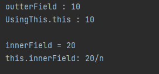

# 람다식
익명 함수를 생성하기 위한 식으로 객제 지향 언어보다는 함수 지향 언어에 가깝다.
객체 지향과는 거리가 있는 얘기지만 자바에 람다식을 수용하는 이유는
````
1.자바 코드가 매우 간결해지며
2.컬렉션의 요소를 필터링하거나 매핑해서 원하는 결과를 쉽게 집계할 수 있다.
````

람다식의 형태는 매개 변수를 가진 코드 블록이지만 런타임 시 익명 구현 객체를 생성한다.
````
Runnable runnable = new Runnable(){
    public void run(){...}
};
````
위의 익명 객체를 아래의 람다식으로 표현할 수 있다.
````
Runnable runnable = () -> {...};
```
### 람다식 문법
() 안에 있는 매개 변수 이름은 자유롭게 할 수 있다. <br>
-> 기호는 매개 변수를 이용하여 중괄호{}를 실행한다는 뜻 <br>
````
(int a) -> {System.out.println(a);}
```
람다식은 매개 변수 타입을 일반적으로 언급하지 않는다.
````
(a) -> {System.out.println(a);}
```
[하나의 매개변수] 만 있다면 ()생략가능 <br>
[하나의 실행문] 만 있다면 중괄호 {} 생략가능
```
a -> System.out.println(a)
```
매개변수가 없다면 빈 괄호() 를 반드시 사용해야 한다.
```
() -> {실행문;...}
```
중괄호 {}를 실행하고 return 값이 있어야 한다면?
```
(x,y) -> {return x+y; }
```
중괄호애 return 문만 있다면, 람다식은 return문을 사용하지 않는다
```
(x,y) -> x+y
````

## 타겟 타입과 함수적 인터페이스
함다식은 하나의 메소드를 정의하기 때문에 2개 이상의 추상 메소드가 선언된 인터페이스는 람다식을 이용하여 구현객체를 생성할 수 없다.
>이는 하나의 추상 메소드만 선언된 인터페이스만이 람다식의 타겟이 될수 있는 것이다.

>함수적 인터페이스를 이용할땐 @FunctionalInterface 어노테이션을 사용하여 메소드의 개수를 판별한다.
````
````
@FunctionalInterface
public interface MyFunctionalInterface{
    public void method();
    public void otherMethod(); //컴파일 오류
}
````
어노테이션과 상관없이 하나의 추상 메소드만 있다면 모두 함수적 인터페이스이다.
````
## 클래스 멤버 사용 this
>람다식 실행 블록에서는 클래스의 멤버인 필드와 메소드를 제약 사항 없이 사용할 수 있다.
> 허나 this 키워드를 사용할 땐 주의가 필요함.

>일반적으로 익명 객체 내부에선 this는 익명 객체의 참조이지만
> 
> 람다식에선 this는 내부적으로 생성되는 익명 객체의 참조가 아니라 람다식을 실행한 객체의 참조이다.

````
````
함수적 인터페이스
public interface MyFunctionalInterface {
    public void method();
}
````
````
this 사용
public class UsingThis {
    public int outterField = 10;

    class Inner{
        int innerField = 20;

        void method(){
            MyFunctionalInterface fi = () -> {
                System.out.println("outterField : " + outterField);
                System.out.println("UsingThis.this : " + UsingThis.this.outterField+"\n"); //바깥 객체의 참조를 얻기위해 클래스명.this 사용

                System.out.println("innerField = " + innerField);
                System.out.println("this.innerField: " + this.innerField+"/n"); //람다식 내부에서 this는 Inner 객체를 참조
            };
            fi.method();
        }
    }
}
````
````
실행 클래스
public class UsingThisExample {
    public static void main(String[] args){
        UsingThis usingThis = new UsingThis();
        UsingThis.Inner inner =usingThis.new Inner();
        inner.method();
    }
}
```



## 로컬 변수 사용
>람다식은 메소드의 내부에서 주로 작성됨
>람다식에서 바깥 클래스의 필드,메소드는 제한 없이 사용할 수 있으나 메소드의 매개 변수 또는 로컬 변수를 사용하면
>이 두 변수는 final 특성을 가져한다.
```aidl
함수적 인터페이스
public interface MyFunctionalInterface {
    public void method();
}
````
````
Final 특성을 가지는 로컬 변수
public class UsingLocalVariable {
    void method(int arg){ //arg 매개변수는 final 특성을 가짐
        int localVar = 40; //localVar 는 final 특성을 가짐

        //arg = 13; final 특성 때문에 수정 불가
        //localVar =41; final 특성 때문에 수정 불가 
        
        //람다식
        MyFunctionalInterface fi =() -> {
            System.out.println(arg);
            System.out.println(localVar);
        };
        fi.method();
    }
}
````
````
실행클래스
public class UsingLocalVariableExample {
    public static void main(String[] args){
        UsingLocalVariable ulv = new UsingLocalVariable();
        ulv.method(20);
    }
}
````


# 함수적 인터페이스
* Consumer
>매개값은 있고 리턴값은 없음
* Supplier
>매개값은 없고 리턴값은 있음
* Function
>매개값도 있고 리턴값도 있음
>주로 매개값을 리턴, 리턴값으로 매핑
* Operator
>매개값도 있고 리턴값도 있음
> 주로 매개값을 연산하고 결과를 리턴
* Predicate
>매가값은 있고 리턴타입은 boolean
> 매가값을 조사해서 true/false를 리턴

