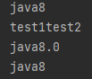
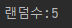
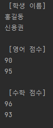
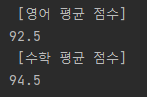
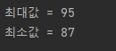

# 함수적 인터페이스
메소드 또는 생성자의 매개 타입으로 사용되어 람다식을 대입할 수 있도록 하기 위해서 쓰인다.

* Consumer
>매개값은 있고 리턴값은 없음
* Supplier
>매개값은 없고 리턴값은 있음
* Function
>매개값도 있고 리턴값도 있음
>주로 매개값을 리턴, 리턴값으로 매핑
* Operator
>매개값도 있고 리턴값도 있음
> 주로 매개값을 연산하고 결과를 리턴
* Predicate
>매가값은 있고 리턴타입은 boolean
> 매가값을 조사해서 true/false를 리턴

## Consumer
매개값은 있고 리턴값은 없음<br>
인터페이스명<br>
`Consumer<T>`
<br>
추상메소드<br>
`void accept(T t)`
>Consumer<String> consumer = t -> {t를 소비하는 실행문;}
````
public class ConsumerExample {
    public static void main(String[] args){

        Consumer<String> consumer = t-> System.out.println(t+"8");
        consumer.accept("java");

        BiConsumer<String,String>bi = (t,u)-> System.out.println(t+u);
        bi.accept("test1","test2");

        DoubleConsumer dsc= d-> System.out.println("java"+d);
        dsc.accept(8.0);

        ObjIntConsumer<String>oi=(t,i)-> System.out.println(t+i);
        oi.accept("java",8);
    }
}
````


## Supplier
매개값은 없고 리턴값은 있음<br>
인터페이스명<br>
`Supplier<T>`
<br>
추상메소드<br>
`T get()`
>Supplier<String> supplier = () -> {...; return 문자열;}
````
public class SupplierExample {
    public static void main(String[] args){
    
    //람디식 시작=========================================
    ㅣ   IntSupplier intSupplier=()->{                  ㅣ
    ㅣ        int num = (int)(Math.random()*6)+1;       ㅣ
    ㅣ        return num;                               ㅣ
    ㅣ   };                                             ㅣ
    ㅣ                                                  ㅣ
    //람디식 끝 ==========================================
        int num = intSupplier.getAsInt();
        System.out.println("랜덤수:"+num);

    }
}
```` 
 
 



## Function
매개값도 있고 리턴값도 있음<br>
인터페이스명<br>
`Function<T,R>`
<br>
추상메소드<br>
`R apply()`
>Function<Student, String> function = t -> {return t.getName(); } <br> 또는 Function<Student, String> function = t -> t.getName();

````
public class FunctionExample1 {
    private static List<Student> list = Arrays.asList(
            new Student("홍길동", 90, 96),
            new Student("신용권",95, 93)
    );
    public static void printString(Function<Student,String> function){
        for(Student student : list){
        
       //람다식 실행================================================
        ㅣ    System.out.println(function.apply(student) + " "); ㅣ
        
        }
        System.out.println();
    }

    public static void printInt(ToIntFunction<Student> function){
        for(Student student : list){
            System.out.println(function.applyAsInt(student) + " ");
        }
        System.out.println();
    }


    public static void main(String[] args){
        System.out.println(" [학생 이름] ");
        printString(t -> t.getName());

        System.out.println(" [영어 점수] ");
        printInt(t -> t.getEnglishScore());

        System.out.println(" [수학 점수] ");
        printInt(t -> t.getMathScore());
    }
}
````

````
public class FunctionExample2 {
    private static List<Student> list = Arrays.asList(
            new Student("홍길동", 90, 96),
            new Student("신용권",95, 93)
    );
    public static double avg(ToIntFunction<Student>function) {
        int sum = 0;
        for (Student student : list) {
            sum += function.applyAsInt(student);
        }
        double avg = (double)sum/list.size();
        return avg;
    }
    
    public static void main(String[] args){
        System.out.println(" [영어 평균 점수] ");
        double en = avg(s -> s.getEnglishScore());
        System.out.println(en);

        System.out.println(" [수학 평균 점수] ");
        double ma = avg(s -> s.getMathScore());
        System.out.println(ma);
    }
}

````


## Operator
매개값도 있고 리턴값도 있음<br>
인터페이스명<br>
`BinaryOperator<T>`
<br>
추상메소드<br>
`T apply(Tt, Tt)`
>IntBinaryOperator operator = (a,b) -> {...; return int 값; }
````
public class OperatorExample {
private static int[] scores = {92, 95, 87};

    public static int maxOrMin(IntBinaryOperator operator){
        int result = scores[0];

        for (int score : scores) {
            result = operator.applyAsInt(result,score);
        }
        return result;
    }

    public static void main(String[] args){
        //최대값 얻기
        int max = maxOrMin(
                (a,b) -> {
                    if(a>=b) return a;
                    else return b;
                }
        );
        System.out.println("최대값 = " + max);

        int min = maxOrMin(
                (a,b) -> {
                    if(a<=b) return a;
                    else return b;
                }
        );
        System.out.println("최소값 = " + min);
    }
}
````

