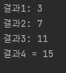

## andThen() 과 compose() 는 디폴트 메소드이다.
두개의 함수적 인터페이스를 순차적으로 연결하고, 첫 번째 처리 결과를 두번째 매개값으로 제공해서 최종 결과값을 얻을 때 사용한다.
>인터페이스AB = 인터페이스A.andThen(인터페이스B); <br>
> 최종결과 = 인터페이스AB.method();

* Consumer<T>
* Function<T>
* Operator<T>

### Consumer 순차적 연결
처리결과를 리턴하지 않기 때문에 andThen() 디폴트 메소드는 인터페이스의 함수적 호출 순서만 정한다.
```
public class Member {
    private String name;
    private String id;
    private Address address;

    public Member(String name, String id, Address address) {
        this.name = name;
        this.id = id;
        this.address = address;
    }

    public String getName() {
        return name;
    }
    public String getId() {
        return id;
    }
    public Address getAddress() {
        return address;
    }
}
``` 
```
public class Address {
    private String country;
    private String city;

    public Address(String country, String city) {
        this.country = country;
        this.city = city;
    }

    public String getCountry() {
        return country;
    }

    public void setCountry(String country) {
        this.country = country;
    }
}
```
```
public class ConsumerAndThenExample {
    public static void main(String[] args){
        Consumer<Member> cm_A = (m) -> {
            System.out.println("consumer A: " +m.getName());
        };

        Consumer<Member> cm_B = (m) -> {
            System.out.println("consumer B: " +m.getId());
        };

        Consumer<Member> cm_AB = cm_A.andThen(cm_B);
        cm_AB.accept(new Member("홍길동","hong", null));

    }
}
```


### Function의 순차적 연결

>여기서 Address는 두 함수적 인터페이스 간의 전달 데이터이다,
>Address는 내부적으로 전달 되기 때문에 최종 함수적 인터페이스의 형태는 입력 데이터가 Member
>출력 데이터가 String 이 되는 Function<Member, String>이 된다. 
* 다음 예제는 Member 객체의 필드인 Address 에서 city정보를 얻기 위해 두 Function 함수적 인터페이스를 andThen() 과 compose()를 이용해서 순차적으로 연결한다.
````
public class FunctionAndThenComposeExample {
    public static void main(String[] args){
        Function<Member, Address> functionA;
        Function<Address, String> functionB;
        Function<Member, String> functionAB;
        String city;

        functionA = (m) -> m.getAddress();
        functionB = (a) -> a.getCity();

        //functionA 안의 값을 먼저 처리하고 andThen의 functionB으로 전달
        functionAB = functionA.andThen(functionB);
        city = functionAB.apply(
                new Member("홍길동","hong",new Address("한국","서울"))
        );

        System.out.println("거주도시: "+city);

        //compose 안의 값을 먼저 처리하고 functionB로 전달 
        functionAB = functionB.compose(functionA);
        city = functionAB.apply(
                new Member("홍길동","hong",new Address("한국","서울"))
        );
        System.out.println("거주도시: " + city);

    }
}
````


## and(), or(), negate() 디폴트 메소드와 isEqual() 정적 메소드
>Predicate 함수적 인터페이스의 메소드들로서 
> 각각 논리연산자인 &&, ||, !로 대응된다. 
> 이증 negate()은 Predicate의 결과가 true이면 false로, false이면 true를 리턴하는 새로운 Predicate를 생성

* 다음 예제는 2의 배수와 3의 배수를 조사하는 두 Predicate를 논리 연산한 새로운 Predicate를 생성
````
public class PredicateAndOrNegateExample {
    public static void main(String[] args){
        IntPredicate predicateA = a -> a%2 ==0;

        IntPredicate predicateB = a -> a%3 ==0;

        IntPredicate predicateAB;
        boolean result;

        predicateAB = predicateA.and(predicateB);
        result = predicateAB.test(9);
        System.out.println("9는 2와 3의 배수입니까?"+result);


        predicateAB = predicateA.or(predicateB);
        result = predicateAB.test(9);
        System.out.println("9는 2 또는 3의 배수입니까?"+result);


        predicateAB = predicateA.negate();
        result = predicateAB.test(9);
        System.out.println("9는 홀수입니까?"+result);
    }
}

````


* isEqual() 메소드는 test() 매개값인 sourceObject와 isEqual()의 매개값인
targetObject를 java.util.Objects 클래스의 equals()의 매개값으로 제공하고 Objects.equals(sourceObject,targetObject)의 리턴값을 얻어 새로운 Predicated<T>를 생성한다.````aidl

````
public class PredicateIsEqualExample {
    public static void main(String[] args){
        Predicate<String> predicate;

        predicate = Predicate.isEqual(null);
        System.out.println("null, null: " +predicate.test(null));

        predicate = Predicate.isEqual("JAVA8");
        System.out.println("null, JAVA8: " + predicate.test(null));

        predicate = Predicate.isEqual(null);
        System.out.println("null, Java8: " + predicate.test("Java8"));

        predicate = Predicate.isEqual("Java7");
        System.out.println("Java7, Java7: " + predicate.test("Java7"));
    }
}
````


# minBy(), maxBy() 정적 메소드
BinaryOperator<T> 함수적 인터페이스는 minBy()와 maxBy() 정적 메소드를 제공한다.
두 메소드는 매개값으로 재공되는 Comparator를 이용해서 최대T와 최소T를 얻는 BinaryOperator<T>를 리턴한다.
>minBy(Comparator<? super T>comparator) <br>
> maxBy(Comparator<? super T>comparator)

Comparator<T>는 다음과 같이 선언된 함수적 인터페이스 이다.
```
@FunctionalInterface
public interface Comparator<T>{
    public int compare(T o1, T o2);
}
```
해당 람다식은 다음과 같이 작성할 수 있다.
>(o1, o2) -> {...; return int값; }

o1, o2가 int값이면 Integer.compare(int, int)메소드 사용
<br>첫번째 매개값이 두 번째 매개값보다 작으면 음수, 같으면 0 크면 양수 리턴
>(o1, o2) -> Integer.compare(o1, o2);

````

public class OperatorMinByMaxByExample {
    public static void main(String[] args){
        BinaryOperator<Fruit>opt;
        Fruit fruit;

        opt = BinaryOperator.minBy((f1,f2)->Integer.compare(f1.getPrice(), f2.getPrice()));
        fruit = opt.apply(new Fruit("딸기",6000), new Fruit("수박",10000));
        System.out.println(fruit.getName());

        opt= BinaryOperator.maxBy((f1,f2)->Integer.compare(f1.getPrice(), f2.getPrice()));
        fruit = opt.apply(new Fruit("딸기",6000), new Fruit("수박",10000));
        System.out.println(fruit.getName());
    }
}
```` 


## 메소드 참조
람다식에서 불필요한 매개 변수를 제거하는것이 목적
<br>
ex)두 개의 값을 받아 큰 수를 리턴하는 Math 클래스의 max() 정적메소드를 호출하는 람다식
>(left, right) -> Math.max(left, right);

다음과 같이 메소드 참조를 이용해보자
>Math :: max;

클래스 :: 메소드<br>
참조변수 :: 메소드
````
==================정적 및 인스턴스 메소드 참조==================
public class MethodReferencesExample {
    public static void main(String[] args){
        IntBinaryOperator operator;

        //정적 메소드 참조
        operator = (x,y) -> Calculator.staticMethod(x, y);
        System.out.println("결과1: " + operator.applyAsInt(1,2));

        //정적 메소드 참조
        operator = Calculator :: staticMethod;
        System.out.println("결과2: " + operator.applyAsInt(3,4));

        Calculator obj = new Calculator();
        operator = (x,y) -> obj.instanceMethod(x,y);
        System.out.println("결과3: " + operator.applyAsInt(5,6));

        operator = obj :: instanceMethod;
        System.out.println("결과4 = " + operator.applyAsInt(7,8));
    }
}
````

### 매개변수의 메소드 참조
>(a,b) -> {a.instanceMethod(b);}

이것을 메소드 참조로 하면 다음과 같다<br>
>클래스 :: instanceMethod
 
람다식에서 재공되는 a 매개 변수의 메소드를 호출해서 b 매개 변수를 매개값으로 사용하는 경우도 있다
<br>
String의 인스턴스 메소드인 compareToIgnoreCase()이다.<br>
a.compareToIgnoreCase(b)가 호출될때 사전순으로 a가 b보다 먼저오면 음수, 동일하면 0, 나중에오면 양수를 리턴

````
public class ArgumentMethodReferencesExample {
    public static void main(String[] args) {
        ToIntBiFunction<String, String> function;

        function = (a, b) -> a.compareToIgnoreCase(b);
        print(function.applyAsInt("java8", "java8"));

        function = String::compareToIgnoreCase;
        print(function.applyAsInt("java8", "java8"));

    }
        public static void print(int order){
            if(order<0){
                System.out.println("사전순으로 먼저옵니다");
            }else if(order == 0){
                System.out.println("동일한 문자열입니다.");
            }else{
                System.out.println("사전순으로 나중에 옵니다.");
            }
        }


}
````


### 생성자 참조
>(a,b) -> {return new 클래스(a,b); }

이경우 생성자 참조로 표현하면 다음과 같다

>클래스 :: new

생성자가 오버로딩 되있을 경우 동일한 매개 변수 타입과 개수를 갖고있는 생성자를 찾아 실행한다.
<br>만약 생성자가 없으면 컴파일 오류가 발생한다.<br>

ex)위의 두 가지 방법으로 Member 객체를 생성하는 것을 확인하자
````
public class Member1 {
    private String name;
    private String id;

    public Member1() {
        System.out.println("Member() 실행");
    }

    public Member1(String id) {
        System.out.println("Member(String id) 실행");
        this.id = id;
    }

    public Member1(String name, String id) {
        System.out.println("Member(String name, String id) 실행");
        this.name = name;
        this.id = id;
    }

    public String getId() {
        return id;
    }
}
````
````
public class ConstructorReferencesExample {
    public static void main(String[] args){
        Function<String, Member1> function1 = Member1 :: new;
        Member1 member1 = function1.apply("angel");

        BiFunction<String, String, Member1> function2 = Member1 :: new;
        Member1 member2 = function2.apply("신천사","angel");
    }
}

````
